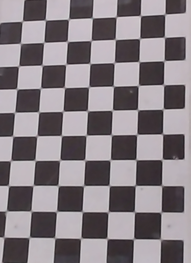

<!-- Improved compatibility of back to top link: See: https://github.com/othneildrew/Best-README-Template/pull/73 -->
<a name="readme-top"></a>
<!--
*** Thanks for checking out the Best-README-Template. If you have a suggestion
*** that would make this better, please fork the repo and create a pull request
*** or simply open an issue with the tag "enhancement".
*** Don't forget to give the project a star!
*** Thanks again! Now go create something AMAZING! :D
-->


<!-- PROJECT LOGO -->
<br />
<div align="center">
  <a href="https://example.com">
    
  </a>

<h3 align="center">RobotVision</h3>

  <p align="center">
    Pick & place uFactory application with computer vision
    <br />
    <a href="https://github.com/VidUrh/RobotVision"><strong>Explore the docs »</strong></a>
    <br />
    <br />
    <a href="https://github.com/VidUrh/RobotVision">Check repo</a>
    ·
    <a href="https://github.com/VidUrh/RobotVision/issues">Report Bug</a>
    ·
    <a href="https://github.com/VidUrh/RobotVision/issues">Request Feature</a>
  </p>
</div>


<!-- TABLE OF CONTENTS -->
<details>
  <summary>Table of Contents</summary>
  <ol>
    <li>
      <a href="#about-the-project">About The Project</a>
      <ul>
        <li><a href="#built-with">Built With</a></li>
      </ul>
    </li>
    <li>
      <a href="#getting-started">Getting Started</a>
      <ul>
        <li><a href="#prerequisites">Prerequisites</a></li>
        <li><a href="#installation">Installation</a></li>
      </ul>
    </li>
    <li><a href="#usage">Usage</a></li>
    <li><a href="#TODO">TODO:</a></li>
    <li><a href="#acknowledgments">Acknowledgments</a></li>
  </ol>
</details>


<!-- ABOUT THE PROJECT -->
## About The Project
### Spletna stran v prihodnosti
 <a href="https://github.com/VidUrh/RobotVision">
    
  </a>


<p align="right">(<a href="#readme-top">back to top</a>)</p>


### Built With

* [![OpenCV][OpenCV]][OpenCV-url]
* [![uFactory][uFactory]][uFactory-url]
* [![Python][Python]][Python-url]
* [![MATLAB][MATLAB]][MATLAB-url]

<p align="right">(<a href="#readme-top">back to top</a>)</p>


<!-- GETTING STARTED -->
## Getting Started


### Prerequisites
1. Clone the repo
   ```sh
   git clone https://github.com/VidUrh/RobotVision.git
    ```
2. Create a virtual environment buy running the batch file
   ```bat
   workstation\make_venv.bat
   ```
3. If the requirements are not installed, install them
   ```sh
   pip install -r workstation\requirements.txt
   ```
### Installation
4. Calibrate the camera with MATLAB camera calibration app
   ```matlab
    calibrate_camera.m
    ```
5. Export calibration parameters to OpenCV format
   ```matlab
    saveMatToPython.m
    ```
6. Compute the homography matrix
   ```python
   getHomographyMtx.py
    ```
7. Set origin coordinate position
    ```python
    autoOriginCalib.py
     ```
8. Calibrate the robot on the same coordinate system
    ```python
    robotCalib.py
    ```
9. Run the main program
    ```python
    vodenjeRobota.py
    ```

<p align="right">(<a href="#readme-top">back to top</a>)</p>


<!-- USAGE EXAMPLES -->
## Usage

This repository can be used for pick and place applications with uFactory robot and computer vision.
Composed of two parts, the camera and the robot, the system is capable of detecting and picking up objects and placing them in a desired location.

_For more examples, please refer to the [Documentation](https://example.com)_ (TODO: pdoc3 auto generate docs)

<p align="right">(<a href="#readme-top">back to top</a>)</p>


<!-- TODO -->
## TODO:

- [ ] Auto robot-camera calibration
- [ ] Homography scale super calibration testing
- [ ] Website for marketing
    - [ ] Add pictures and videos
- [ ] Add documentation
- [ ] Add more examples
- [ ] Test the robustness of the system
- [ ] Camera calibration GUI app (tkinter)
- [x] Robot calibration GUI app (tkinter)

See the [open issues](https://github.com/VidUrh/RobotVision/issues) for a full list of proposed features (and known issues).

<p align="right">(<a href="#readme-top">back to top</a>)</p>


<!-- ACKNOWLEDGMENTS -->
## Acknowledgments

* RLS Merilna tehnika d.o.o.

<p align="right">(<a href="#readme-top">back to top</a>)</p>


<!-- MARKDOWN LINKS & IMAGES -->
<!-- https://www.markdownguide.org/basic-syntax/#reference-style-links -->
[contributors-shield]: https://img.shields.io/github/contributors/VidUrh/RobotVision.svg?style=for-the-badge
[contributors-url]: https://github.com/VidUrh/RobotVision/graphs/contributors
[forks-shield]: https://img.shields.io/github/forks/VidUrh/RobotVision.svg?style=for-the-badge
[forks-url]: https://github.com/VidUrh/RobotVision/network/members
[stars-shield]: https://img.shields.io/github/stars/VidUrh/RobotVision.svg?style=for-the-badge
[stars-url]: https://github.com/VidUrh/RobotVision/stargazers
[issues-shield]: https://img.shields.io/github/issues/VidUrh/RobotVision.svg?style=for-the-badge
[issues-url]: https://github.com/VidUrh/RobotVision/issues
[license-shield]: https://img.shields.io/github/license/VidUrh/RobotVision.svg?style=for-the-badge
[license-url]: https://github.com/VidUrh/RobotVision/blob/master/LICENSE.txt
[linkedin-shield]: https://img.shields.io/badge/-LinkedIn-black.svg?style=for-the-badge&logo=linkedin&colorB=555
[product-screenshot]: images/logo.png
[OpenCV]: https://img.shields.io/badge/OpenCV-27338e?style=for-the-badge&logo=OpenCV&logoColor=white
[OpenCV-url]: https://opencv.org/
[uFactory]: https://img.shields.io/badge/uFactory-27338e?style=for-the-badge&logo=uFactory&logoColor=white
[uFactory-url]: https://www.ufactory.cc/
[Python]: https://img.shields.io/badge/Python-FFD43B?style=for-the-badge&logo=python&logoColor=blue
[Python-url]: https://www.python.org/
[MATLAB]: https://img.shields.io/badge/MATLAB-27338e?style=for-the-badge&logo=MATLAB&logoColor=white
[MATLAB-url]: https://www.mathworks.com/products/matlab.html
